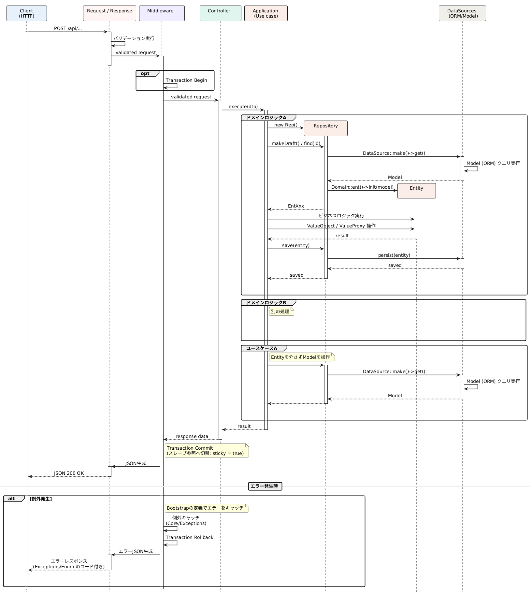

---
markdown-pdf:
  styles: ["laravel.css"]
---

<link rel="stylesheet" href="laravel.css">

<div class="doc-title">
  <div class="doc-title__eyebrow">DEVELOPER GUIDE</div>
  <h1>Laravel 実装ガイド</h1>
  <div class="doc-title__meta">bc.draft &middot; Laravel 12 / PHP 8.4</div>
</div>

<div class="doc-toc-print">

**目次**

[概要](#overview) / [ディレクトリ構成](#directory) / [リクエスト〜レスポンスの流れ](#flow) / [レイヤー別の役割](#layers) / [Hub パターン](#hub) / [新機能を実装する手順](#howto) / [命名規則](#naming) / [例外・エラーハンドリング](#exception) / [使用技術](#stack) / [参考資料](#reference)

</div>

<div class="doc-layout">

<nav class="doc-nav">

**目次**

- [概要](#overview)
- [ディレクトリ構成](#directory)
- [リクエスト〜レスポンスの流れ](#flow)
- [レイヤー別の役割](#layers)
- [Hub パターン（サービスロケータ）](#hub)
- [新機能を実装する手順](#howto)
- [命名規則](#naming)
- [例外・エラーハンドリング](#exception)
- [使用技術](#stack)
- [参考資料](#reference)

</nav>

<div class="doc-content">

<a id="overview"></a>
## 概要

本ドキュメントは、本プロジェクト（Laravel 12 / PHP 8.4）における実装方法をまとめたものです。<br />
設計思想（DDD・責務分離）については [docs/ddd/src/overview.md](../../ddd/src/overview.md) を参照してください。<br />
こちらでは実際のディレクトリ構成・命名規則・実装手順など、**手を動かすための具体的な情報**を中心にまとめます。

---

<a id="directory"></a>
## ディレクトリ構成

| パス | 種別 | 役割 |
|:--|:--|:--|
| app/ | ディレクトリ | アプリケーションコードのルート |
| ├─ Core/ | ディレクトリ | フレームワークに依存する共通基盤（原則アプリ固有ロジックを持たない） |
| │　├─ Http/ | ディレクトリ | HTTP層の共通基盤 |
| │　│　├─ Controllers/BaseCnt.php | ファイル | Controller 基底クラス |
| │　│　├─ Applications/BaseApp.php | ファイル | Application 基底クラス |
| │　│　├─ Middlewares/ | ディレクトリ | Mdl*.php（Transaction / Response 制御など） |
| │　│　├─ Requests/BaseReq.php, ReqNone.php | ファイル | FormRequest 基底クラス |
| │　│　└─ Responses/BaseRes.php, ResSuccess.php, ResFailed.php | ファイル | Response 基底クラス |
| │　├─ Domains/ | ディレクトリ | ドメイン層の共通基盤 |
| │　│　├─ Entity/BaseEnt.php | ファイル | Entity 基底クラス |
| │　│　├─ Repository/BaseRep.php | ファイル | Repository 基底クラス |
| │　│　├─ ValueObject/BaseVo.php, BaseMstVo.php | ファイル | ValueObject 基底クラス |
| │　│　└─ ValueProxy/BaseVp.php | ファイル | ValueProxy 基底クラス |
| │　├─ DataSources/BaseDs.php, BaseMstDs.php | ファイル | DataSource 基底クラス |
| │　├─ Exceptions/ | ディレクトリ | ExceptApp / ExceptModel と Enum/TypeExcept |
| │　└─ Libraries/ | ディレクトリ | 横断的ライブラリ群 |
| │　　├─ Traits/ | ディレクトリ | TraitCore / TraitDomain / TraitInfra / TraitResponse / TraitUtil ... |
| │　　└─ Stateful, Stateless | ディレクトリ | シングルトン・静的ファサード類 |
| ├─ Domains/ | ディレクトリ | 機能ドメインごとの実装（Account / Item / Gacha / Idle / User） |
| │　└─ Item/ | ディレクトリ | 機能ドメインの実装例 |
| │　　├─ EntItem.php | ファイル | Entity |
| │　　├─ RepItem.php | ファイル | Repository |
| │　　├─ VoHub.php | ファイル | ValueObject 登録 |
| │　　└─ VpHub.php | ファイル | ValueProxy 登録 |
| ├─ DataSources/ | ディレクトリ | Ds*.php（Eloquent Model への直接アクセス層） |
| ├─ Http/ | ディレクトリ | 機能ごとのHTTP実装 |
| │　├─ Controllers/Cnt*.php | ファイル | Controller |
| │　├─ Applications/App*.php, Applications/UseCase/Uc*.php | ファイル | Application / UseCase |
| │　├─ Requests/{Feature}/Req*.php | ファイル | FormRequest |
| │　└─ Responses/{Feature}/Res*.php | ファイル | Response |
| └─ Models/ | ディレクトリ | Eloquent Model 本体 |

**原則**：`Core/` 配下は横断的な基盤コードのみを置き、機能固有のロジックは `Domains/` `Http/` 配下に実装します。

---

<a id="flow"></a>
## リクエスト〜レスポンスの流れ

`routes/api.php` → Middleware → Controller → (Application / UseCase) → Repository → Entity/ValueObject/ValueProxy → DataSource(Model) → Response、という一方向の流れで実装します。

`app/Domains/Item` の実装を例に、更新系（書き込み）と参照系（読み取り）の2パターンを示します。

まず全体像として、リクエストからレスポンスまでのシーケンス図を示します（詳細は [docs/ddd/src/overview.md](../../ddd/src/overview.md) 参照）。

<div style="text-align:center;">
  
</div>

### ① 更新系（Application 経由）

`POST /develop/item-add` の例：

```php
// routes/api.php
Route::prefix('develop')->controller(CntDevelop::class)->group(function () {
    Route::post('item-add', 'itemAdd');
});
```

```php
// app/Http/Controllers/CntDevelop.php
public function itemAdd(AppDevelop $app, ReqDevelopItemAdd $req): void
{
    $this->_ResponseModify::set(ResSuccess::class);
    $app->itemAdd($req);
}
```

```php
// app/Http/Applications/AppDevelop.php
public function itemAdd(ReqDevelopItemAdd $req): void
{
    $rep_item = $this->_Domain::rep(RepHub::REP_ITEM);
    $ent_item = $rep_item->find($req->user_id, $req->item_id);
    if ($ent_item->isEmpty()) {
        $ent_item = $rep_item->makeDraft($req->user_id, $req->item_id);
    }

    $vo_item = $this->_Domain::mstVo(VoHub::VO_M_ITEM)->findOrFail($req->item_id);
    $ent_item->end_at($vo_item->end_at);
    $sum_amount = $vo_item->clampToMaxStock($ent_item->amount + $req->amount);

    $ent_item->amount($sum_amount);
    $rep_item->persist($ent_item);
}
```

Controller は `AppDevelop` と `ReqDevelopItemAdd`（FormRequest）を**型ヒントするだけ**で、Laravel のコンテナがバリデーション込みで解決してくれます。Controller はどの `Response` クラスを使うかを `_ResponseModify::set()` で指定するだけで、ビジネスロジックは持ちません。

### ② 参照系（Response 直結・薄いController）

`GET /item/find` の例：

```php
// app/Http/Controllers/CntItem.php
public function find(): void
{
    $this->_ResponseModify::set(ResItemFind::class);
}
```

```php
// app/Http/Responses/Item/ResItemFind.php
public function toResponse(Request|ReqItemFind $req): JsonResponse
{
    $rep_item = $this->_Domain::rep(RepHub::REP_ITEM);
    $ent_item = $rep_item->findOrFail($req->user_id, $req->item_id);
    $this->_result['items'][] = $ent_item->toArray();

    return response()->json(['success' => 1, 'result' => (object)$this->_result]);
}
```

単純な参照系（更新を伴わない GET）は Application を経由せず、`Response` クラスが直接 Repository を呼び出す薄い構成にできます。**更新を伴う／複数ドメインをまたぐ処理は Application(UseCase) を経由させる**のが原則です。

### ③ Middleware によるレスポンス生成とトランザクション制御

- `mdl.response`（`MdlResponse`）：Controller 内で `_ResponseModify::set()` されたクラスを解決し、`toResponse()` を呼んで最終的な `JsonResponse` を生成。HTTPステータスが 200 以外なら例外を投げる。
- `mdl.transaction`（`MdlTransaction`）：レスポンス生成後、ロールバックフラグが立っていなければ開いているトランザクションを commit、立っていれば rollback。

これにより、**Controller / Application 側は例外を投げるだけで良く、commit/rollback を意識する必要がない**構成になっています（`bootstrap/app.php` の `withExceptions` で例外発生時に `StfStaTransaction::enableRollback()` が呼ばれます）。

---

<a id="layers"></a>
## レイヤー別の役割

| レイヤー | 命名 | 役割 | 実装例 |
|:--|:--|:--|:--|
| Controller | `Cnt*` | Response クラスの指定、Application 呼び出し。ロジックを持たない | `CntItem`, `CntDevelop` |
| Application / UseCase | `App*` / `Uc*` | ユースケース単位の処理を組み立てる。複数 Repository をまたぐ調整役 | `AppDevelop`, `UcCreateApiToken` |
| Repository | `Rep*` | DataSource から Model を取得し Entity へ変換／永続化 | `RepItem` |
| Entity | `Ent*` | ドメインの振る舞い（ビジネスルール）を持つ。ValueProxy 経由で状態変更 | `EntItem` |
| ValueObject | `Vo*` / マスタは `VoM*` | 不変なマスタデータ・値の集合を表現 | `VoMItem` |
| ValueProxy | `Vp*` | Entity の Mutable な状態変更ロジックを分離 | `VpItem` |
| DataSource | `Ds*` | Eloquent Model への実クエリ実行（ORM 操作はここに閉じ込める） | `DsUItem` |
| Request | `Req*` | `FormRequest` を継承したバリデーション定義 | `ReqItemFind` |
| Response | `Res*` | レスポンス整形。参照系はここで直接取得することもある | `ResItemFind` |

Entity・ValueObject・DataSource は `App\Core\Domains\*` / `App\Core\DataSources\*` の Base クラスを継承して実装します。

---

<a id="hub"></a>
## Hub パターン（サービスロケータ）

各ドメインの Repository / Entity / ValueObject / ValueProxy / DataSource は、**クラス名を直接 `use` せず** `*Hub` クラスの定数経由で参照します。

```php
// app/Domains/RepHub.php
final class RepHub
{
    const string REP_ITEM = RepItem::class;
    const string REP_GACHA = RepGacha::class;
    // ...
}
```

呼び出し側は `TraitDomain` を通じて生えている `_Domain` ファサードから解決します。

```php
$rep_item = $this->_Domain::rep(RepHub::REP_ITEM);
$ent_item = $this->_Domain::ent(EntHub::ENT_ITEM)->init($model);
$vo_item  = $this->_Domain::mstVo(VoHub::VO_M_ITEM)->findOrFail($id);
$vp_item  = $this->_Domain::vp(VpHub::VP_ITEM)->init($this);
```

同様に UseCase は `UcHub` 定数 + `_UseCase::make()` で解決します（`AppAccount::login()` 参照）。<br />
**新しいクラスを追加したら、対応する `*Hub` への定数追加を忘れないこと。**

---

<a id="howto"></a>
## 新機能を実装する手順

例：新しい機能ドメイン `Foo` に更新系エンドポイント `POST /foo/do` を追加する場合。

| # | 手順 | 配置先 | 内容 |
|:--|:--|:--|:--|
| 1 | Route定義 | routes/api.php | `Route::prefix('foo')->controller(CntFoo::class)->group(...)` を追加 |
| 2 | Request作成 | app/Http/Requests/Foo/ReqFooDo.php | `BaseReq` を継承したバリデーションクラスを作成 |
| 3 | Controller作成 | app/Http/Controllers/CntFoo.php | `BaseCnt` を継承し、`do(AppFoo $app, ReqFooDo $req)` を実装。中身は `_ResponseModify::set()` と `$app->do($req)` のみ |
| 4 | Application作成 | app/Http/Applications/AppFoo.php | `BaseApp` を継承し、`do()` にユースケースを実装。複数ドメインをまたぐ／再利用したい処理は `Http/Applications/UseCase/Foo/Uc*.php` に切り出す |
| 5 | Domain実装 | app/Domains/Foo/ | `EntFoo`（`BaseEnt` 継承）・`RepFoo`（`BaseRep` 継承）・必要に応じて `VoFoo` / `VpFoo` を作成 |
| 6 | DataSource作成 | app/DataSources/DsFoo.php | `BaseDs` を継承し、Eloquent Model へのクエリを実装 |
| 7 | Hub登録 | RepHub / EntHub / DsHub（必要なら VoHub / VpHub / UcHub） | 対応する定数を追加 |
| 8 | Response作成 | app/Http/Responses/Foo/ResFoo*.php | 参照系のみを持たせたい場合は直接 Repository を呼ぶ実装を追加し、Controller からは `_ResponseModify::set()` のみ呼ぶ |
| 9 | 例外 | App\Core\Exceptions\Enum\TypeExcept | 業務エラーの種別を追加し `$this->_Except::app(TypeExcept::Xxx)` で投げる |

---

<a id="naming"></a>
## 命名規則

| プレフィックス | 意味 | 配置 |
|:--|:--|:--|
| `Cnt` | Controller | `app/Http/Controllers` |
| `App` | Application（ユースケースの組み立て） | `app/Http/Applications` |
| `Uc` | UseCase（Application から切り出した単一処理） | `app/Http/Applications/UseCase` |
| `Rep` | Repository | `app/Domains/{Feature}` |
| `Ent` | Entity | `app/Domains/{Feature}` |
| `Vo` / `VoM` | ValueObject（`VoM`はマスタ系） | `app/Domains/{Feature}` |
| `Vp` | ValueProxy | `app/Domains/{Feature}` |
| `Ds` / `DsU` / `DsM` | DataSource（`U`=ユーザデータ、`M`=マスタ） | `app/DataSources` |
| `Req` | FormRequest | `app/Http/Requests/{Feature}` |
| `Res` | Response | `app/Http/Responses/{Feature}` |
| `Mdl` | Middleware | `app/Core/Http/Middlewares` |
| `*Hub` | クラス参照定数の集約 | 各ドメイン配下 |

---

<a id="exception"></a>
## 例外・エラーハンドリング

`bootstrap/app.php` の `withExceptions()` で一元的にハンドリングされます。

- `ExceptApp` を継承した例外 → HTTP 422
- `ExceptModel` を継承した例外 → HTTP 404
- それ以外 → HTTP 401

例外発生時は自動的に `StfStaTransaction::enableRollback()` が呼ばれ、`mdl.transaction` ミドルウェアが開いているトランザクションを rollback します。業務エラーは次の形で投げます。

```php
throw $this->_Except::app(TypeExcept::AppItemNotEnoughUnits);
```

---

<a id="stack"></a>
## 使用技術

- Laravel 12（PHP 8.4）
- Laravel Sanctum（API 認証）
- Laravel MCP（`app/Mcp` 配下）
- Docker（MySQL, Redis）
- AWS（EC2, RDS, Valkey）

---

<a id="reference"></a>
## 参考資料

- 設計思想・レイヤー構成の全体像：[docs/ddd/src/overview.md](../../ddd/src/overview.md)（[GitHub: nukui-ddd](https://github.com/bit-craft-io/nukui-ddd)）
- Xdebug 環境構築：[docs/xdebug/src/xdebug.md](../../xdebug/src/xdebug.md)

</div>
</div>
