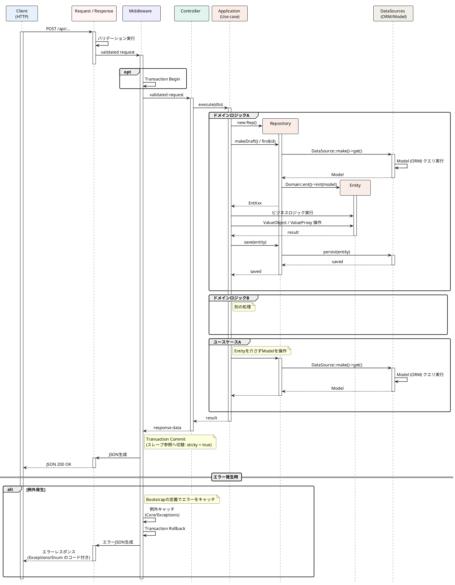

# 概要

**GitHub:** https://github.com/bit-craft-io/nukui-ddd

---

### 設計思想

- **責務分離**：誰が何を知るべきかを構造で強制する
- **DDD**：ビジネスルールをコードで自然言語化する
- **ユビキタス言語**：設計者と開発者が同じ言葉で話せる状態を作る
---

### レイヤー構成

```plantuml
@startuml
top to bottom direction
!pragma layout smetana
skinparam roundCorner 15

skinparam rectangle {
    BorderColor<<dummy>> transparent
    BackgroundColor<<dummy>> transparent
    Shadowing<<dummy>> false
    FontColor<<dummy>> transparent
}

frame "プレゼンテーション層" #FFF5F5 {
      rectangle Request #FFFFFF
      rectangle Response #FFFFFF
      rectangle Controller #FFFFFF

      Request -[hidden]r-> Response
      Response -[hidden]r-> Controller

      ' spacing
      rectangle " " as right1 <<dummy>>
      rectangle " " as left1 <<dummy>>
      left1 -[hidden]r-> Request
      Controller -[hidden]r-> right1

      frame "アプリケーション層" #E6F1FB {
            rectangle Application #FFFFFF
            rectangle Repository #FFFFFF

            Application -[hidden]r-> Repository
            Request -[hidden]d-> Application

            ' spacing
            rectangle " " as right2 <<dummy>>
            rectangle " " as left2 <<dummy>>
            left2 -[hidden]r-> Application
            Repository -[hidden]r-> right2

            frame "ドメイン層" #FAECE7 {
                  rectangle Entity #FFFFFF
                  rectangle ValueObject #FFFFFF
                  rectangle ValueProxy #FFFFFF {
                        
                  }

                  Entity -[hidden]r-> ValueObject
                  ValueObject -[hidden]r-> ValueProxy
                  Application -[hidden]d-> Entity

                  ' spacing
                  rectangle " " as right3 <<dummy>>
                  rectangle " " as left3 <<dummy>>
                  left3 -[hidden]r-> Entity
                  ValueProxy -[hidden]r-> right3

                  frame "インフラ層" #F1EFE8 {
                        rectangle DataSources #FFFFFF
                        rectangle Model #FFFFFF

                        DataSources -[hidden]r-> Model
                        Entity -[hidden]d-> DataSources

                        ' spacing
                        rectangle " " as right4 <<dummy>>
                        rectangle " " as left4 <<dummy>>
                        rectangle " " as dummy4 <<dummy>>
                        left4 -[hidden]r-> DataSources
                        Model -[hidden]r-> right4
                        ' right4 の右に dummy4 を配置
                        right4 -[hidden]r-> dummy4
                  }
            }
      }
}
@enduml
```

---

### 主な設計ポイント

- DataSources 経由で ORM を操作し、ドメイン層が DB を意識しない構造
- Entity / ValueObject の集合を Iterator で表現（メモリ効率重視）
- Transaction と Response の制御を Middleware に集約
- ValueProxy で Mutable な状態管理を明示的に分離
---

### シーケンス図

---

### 使用技術

- Laravel（PHP 8.4）
- Docker（MySQL, Redis）
- AWS（EC2, RDS, Valkey）
