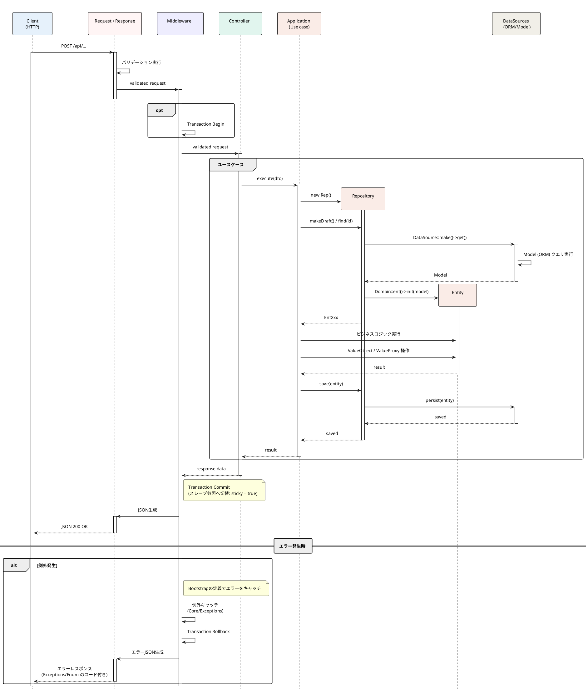

### リクエストフロー

```plantuml
@startuml

hide footbox

skinparam sequenceArrowThickness 1.5
skinparam roundcorner 6
skinparam sequenceParticipantBorderThickness 1
skinparam defaultFontSize 14

skinparam ParticipantPadding 20
skinparam BoxPadding 20
skinparam sequenceMessageAlign center
skinparam padding 10

skinparam sequenceLifeLineBorderThickness 1
skinparam sequenceLifeLineBorderColor #black

header " "
footer " "

participant "       Client       \n       (HTTP)       " as Client #E6F1FB
participant " Request / Response \n"                     as Req #FFF5F5
participant "    Middleware      \n"                     as MW #EEEDFE
participant "    Controller      \n"                     as Ctrl #E1F5EE
participant "    Application     \n     (Use case)     " as App #FAECE7
participant "     Repository     \n"                     as Rep #FAECE7
participant "       Entity       \n"                     as Ent #FAECE7
participant "    DataSources     \n     (ORM/Model)    " as DS #F1EFE8

' == HTTPリクエスト受付 ==

Client -> Req : POST /api/...
activate Client
activate Req

Req -> Req : バリデーション実行
Req -> MW : validated request
activate MW
deactivate Req

opt
MW -> MW : Transaction Begin
end

' == コントローラー呼び出し ==

MW -> Ctrl : validated request
activate Ctrl

group ユースケース

    Ctrl -> App : execute(dto)
    activate App

    ' == リポジトリ生成 ==

    App -> Rep ** : new Rep()
    activate Rep

    ' == データ取得 → エンティティ生成 ==

    App -> Rep : makeDraft() / find(id)

    Rep -> DS : DataSource::make()->get()
    activate DS
    DS -> DS : Model (ORM) クエリ実行
    DS --> Rep : Model
    deactivate DS

    Rep -> Ent ** : Domain::ent()->init(model)
    activate Ent
    Rep --> App : EntXxx

    ' == ドメインロジック ==

    App -> Ent : ビジネスロジック実行
    App -> Ent : ValueObject / ValueProxy 操作
    Ent --> App : result
    deactivate Ent

    ' == 永続化 ==

    App -> Rep : save(entity)

    Rep -> DS : persist(entity)
    activate DS
    DS --> Rep : saved
    deactivate DS

    Rep --> App : saved
    deactivate Rep

    ' == レスポンス生成 ==

    App --> Ctrl : result
    deactivate App
end

Ctrl --> MW : response data
deactivate Ctrl

note right of MW
  Transaction Commit
  (スレーブ参照へ切替: sticky = true)
end note

MW -> Req : JSON生成
activate Req
Req --> Client : JSON 200 OK
deactivate Req

== エラー発生時 ==

alt 例外発生
    note right of MW
    Bootstrapの定義でエラーをキャッチ
    end note
    MW -> MW : 例外キャッチ\n(Core/Exceptions)
    MW -> MW : Transaction Rollback
    MW -> Req : エラーJSON生成
    activate Req
    Req --> Client : エラーレスポンス\n(Exceptions/Enum のコード付き)
    deactivate Req
end

deactivate MW
deactivate Client

@enduml
```
