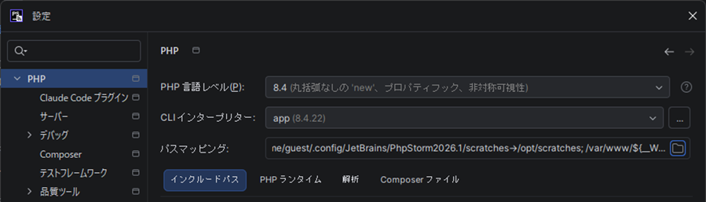
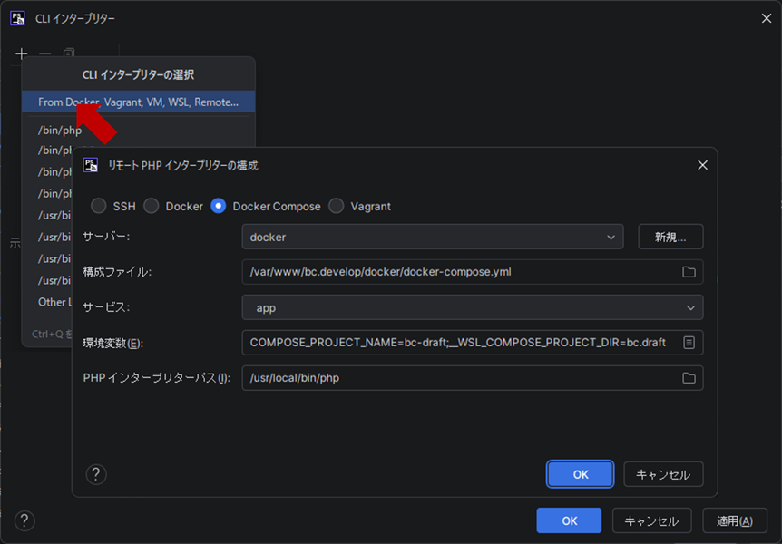
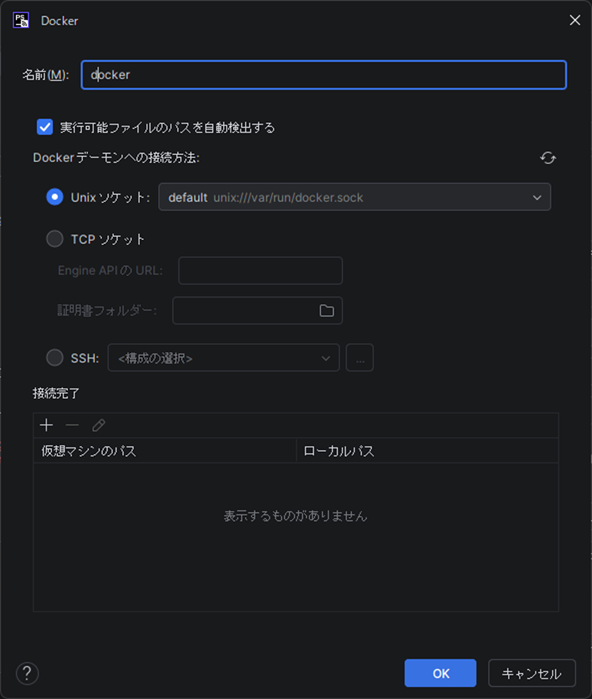
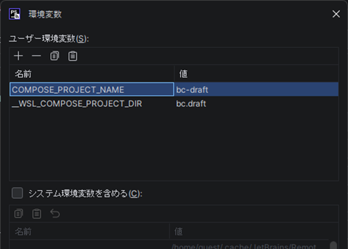
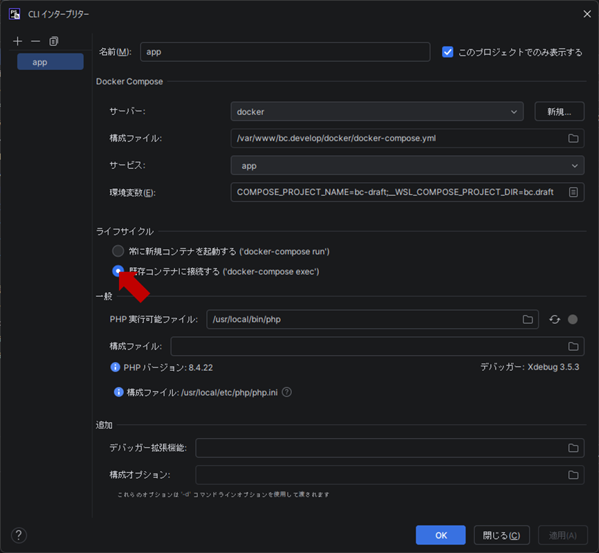
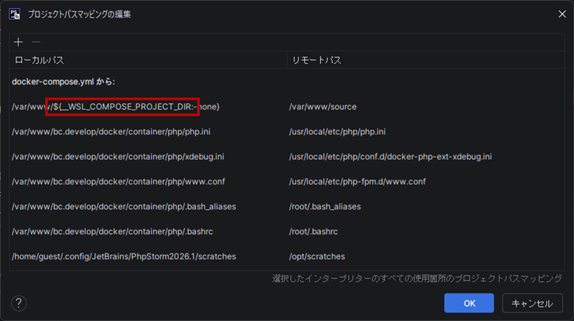
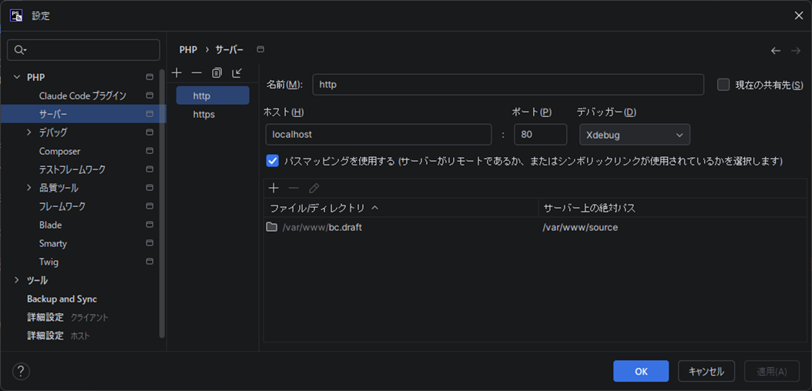
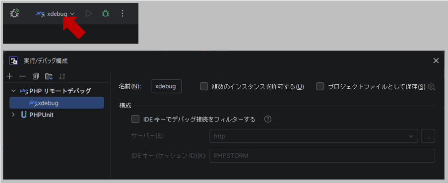
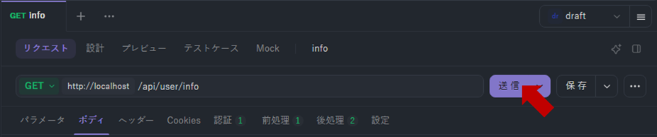
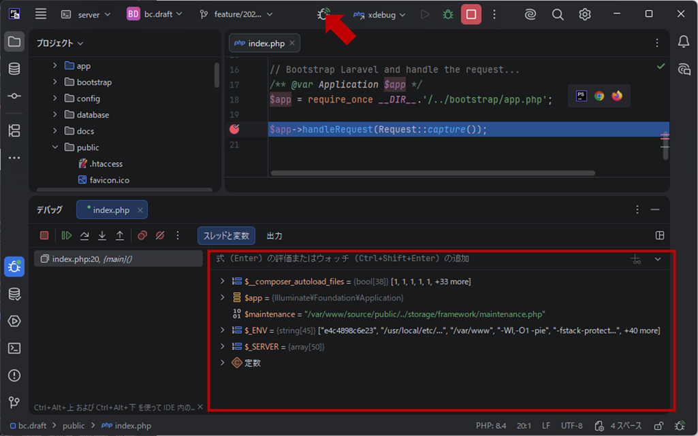

## 概要
- PhpStorm + WSL + Docker でXdebugを使用

### PhpStormの設定
1. インタプリターはコンテナ（docker-compose.yml の app）の php を使用

    

2. リモートPHPを選択し各設定を入力

|設定項目|設定内容|備考|
|:--|:--|:--|
|接続方式|Docker Compose||
|サーバー|docker|新規作成|
|構成ファイル|/var/www/bc.develop/docker/docker-compose.yml||
|サービス|app||
|環境変数|COMPOSE_PROJECT_NAME=bc-draft __WSL_COMPOSE_PROJECT_DIR=bc.draft|docker-compose.yml で使用してる.envの内容|

  

  
  

3. 稼働中のコンテナを選択

  

4. プロジェクトパスマッピング

  

5. サーバーの設定

  

6. プロファイルの設定

  

### ApiDogから実行（ブレイクポイントで止まる事を確認）
- ApiDog

  

- PhpStorm

  

### ブレークポイントで止まらない場合
- PhpStormのデバッグの項目「PHPスクリプトの最初の行で中断する」をONにしてみる。
- PHPデバッグ接続のリッスンを停止・開始してみる。
- コンテナを再起動してみる。
